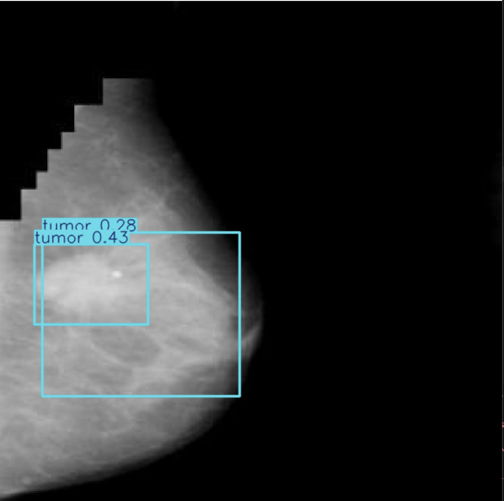
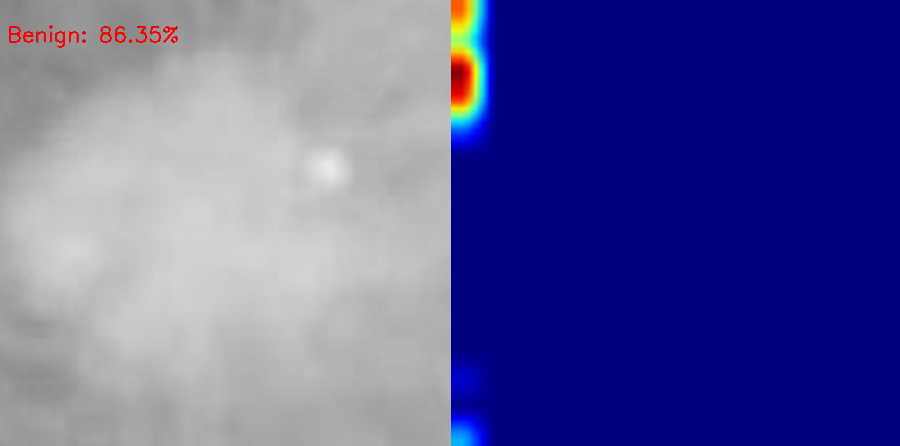
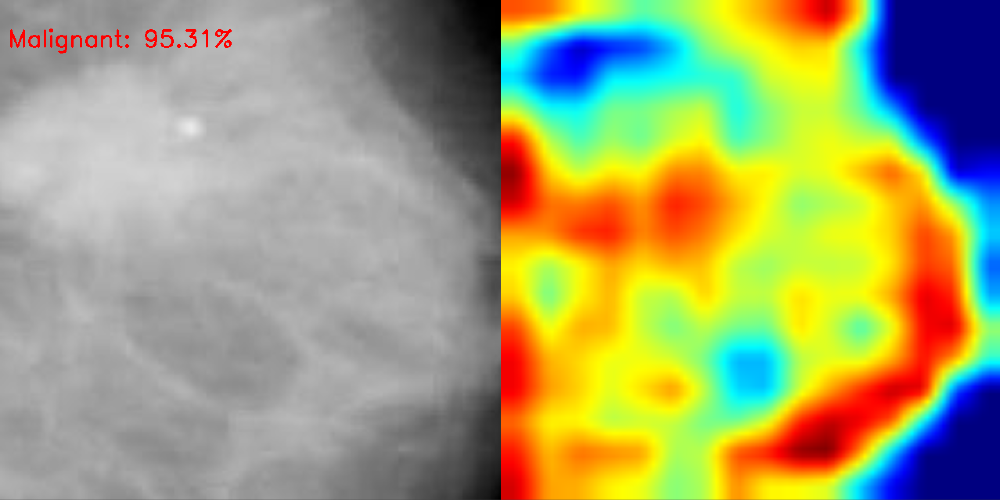

# Breast Cancer Cell Detection using YOLO + Grad-CAM

A computer vision pipeline that detects breast cancer regions in medical images and explains model decisions using Grad-CAM heatmaps.

---

## How It Works

1. **YOLO** detects suspicious regions in the image and draws bounding boxes
2. **CNN** classifies each detected region as benign or malignant
3. **Grad-CAM** generates a heatmap showing which pixels influenced the CNN's decision
4. Results are displayed side by side — original crop + heatmap overlay

---

## Project Structure

```txt
BreastCancerDetection/
├── BreastCellDetection.py   # Main pipeline — YOLO + CNN + Grad-CAM
├── train.py                 # Fine-tunes YOLO on breast cancer dataset
├── crop_dataset.py          # Crops YOLO detections and saves by class
├── cnn_train.py             # Trains custom CNN on cropped regions
├── data.yaml                # YOLO dataset config
├── best.pt                  # Trained YOLO weights
├── cancer_cnn.pth           # Trained CNN weights
└── README.md
```

---

## Tech Stack

- Python
- PyTorch
- Ultralytics YOLO
- OpenCV
- pytorch-grad-cam
- Pillow

---

## Dataset

Downloaded from [Roboflow Universe](https://universe.roboflow.com/breast-cancer-detection-roclf/breast-cancer-detection-jixc0/dataset/2) — 5,406 annotated breast cancer images in YOLOv11 format with two classes: benign and tumor.

---

## Installation

```bash
git clone https://github.com/AurickAnwar/Cancer-Cell-Detection.git
cd Cancer-Cell-Detection
pip install torch torchvision ultralytics opencv-python pytorch-grad-cam Pillow grad-cam
```

---

## Usage

**Step 1 — Train YOLO** (one time only):
```bash
python train.py
```

**Step 2 — Crop detections for CNN training** (one time only):
```bash
python crop_dataset.py
```

**Step 3 — Train CNN** (one time only):
```bash
python cnn_train.py
```

**Step 4 — Run the full pipeline:**
```bash
python BreastCellDetection.py
```

---

## Output

- YOLO bounding boxes around detected regions
- CNN classification (Benign / Malignant) with confidence score
- Grad-CAM heatmap showing which regions influenced the prediction
- Side by side display of original crop and heatmap



---

## Grad-CAM

- 🔴 Red / yellow → high importance regions
- 🔵 Blue → low importance regions

Grad-CAM makes the model explainable — critical in medical AI where trust and interpretability matter.

---

### Grad-CAM Explainability
**Benign Detection (86.35% confidence)**


**Malignant Detection (95.31% confidence)**


## Future Improvements

- Improve CNN accuracy with deeper architectures (ResNet, EfficientNet)
- Add multi-class grading (tumor stage G1, G2, G3)
- Add batch inference for folders of images
- Build a simple UI for clinical demo purposes

---

## Disclaimer

This project is for **educational and research purposes only**. It is not a medical device and should not be used for clinical diagnosis.
